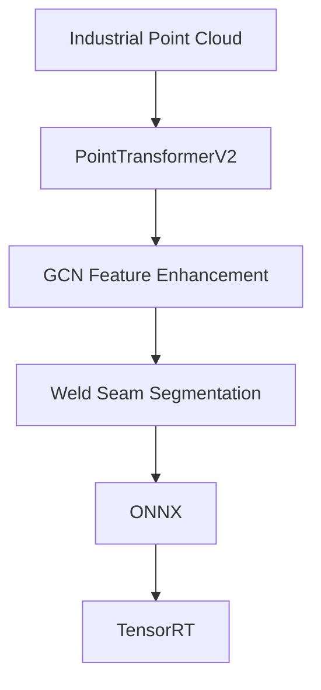

# PTV2 Weld Seam Segmentation and Deployment

PointTransformerV2-based industrial weld seam point cloud segmentation and deployment project. The repository covers model training and evaluation, GCN/LFA feature-enhancement experiments, and preparation for ONNX, TensorRT, and C++ CUDA inference.

## Project Overview

The model receives a normalized industrial point cloud and predicts a semantic class for every point:

- `points`: `float32 [B, 2048, 4]` — normalized XYZ plus weld-category feature
- `adj`: `float32 [B, 2048, 2048]` — dense `k=6` adjacency matrix
- `logits`: `float32 [B, 2048, 2]`

Label semantics:

- class 0: `weld_seam`
- class 1: `background`

The selected deployment model is `models/testParameters/GCN_res/model.py`. Checkpoints, datasets, generated artifacts, and exported engines are intentionally excluded from Git.

## Features

- PointTransformerV2-based weld seam semantic segmentation
- GCN and LFA feature-enhancement model variants
- Reproducible PyTorch training and checkpoint evaluation pipeline
- Fixed-shape deployment interface for points and adjacency inputs
- Standard-operator replacement for `torch_cluster::grid` voxel pooling
- Verified `trunc -> floor` voxel-coordinate equivalence on the weld dataset
- ONNX deployment preparation and numerical-alignment tooling
- TensorRT and C++ CUDA deployment roadmap

## Method



## Model Benchmark

The fixed validation and test splits contain industrial weld point clouds. Labels were verified through CloudCompare scalar-field visualization.

| Model | Dataset | Test mIoU | Weld seam F1 |
|---|---|---:|---:|
| GCN_res | Industrial weld point cloud | 93.63% | 94.68% |

Full benchmark values:

- test mIoU: `0.936309`
- weld seam F1: `0.946799`

## Deployment Progress

- [x] PyTorch inference
- [x] Checkpoint strict-load validation
- [x] RTX 5060 CUDA forward validation
- [x] Standard-operator voxel pooling replacement
- [x] `trunc -> floor` definition-domain equivalence validation
- [x] ONNX wrapper and export preparation
- [x] ONNX Runtime parity investigation and deployment graph validation
- [x] TensorRT strict-FP32 production baseline qualification
- [ ] C++ inference

The current production baseline uses the CUB-optimized `VoxelUniqueCub` plugin. It passed 18-sample task-equivalence, 10/10 cold starts, 5000/5000 soak inference, and fail-closed negative tests. Generated engines and binaries remain excluded from Git.

Production entry points:

- `scripts/run_gcn_res_tensorrt_production.py`
- `deployment/tensorrt/current_baseline.json`
- `docs/tensorrt_production_runbook.md`

The promoted baseline is task-equivalent but retains an explicit strict numerical exception: 13/18 samples meet per-sample `max_abs < 1e-4`; labels and task metrics match 18/18.

## Validated Environment

| Component | Version |
|---|---|
| Operating system | Windows |
| Python | 3.11.8 |
| PyTorch | 2.7.1+cu128 |
| PyTorch CUDA Runtime | 12.8 |
| GPU | NVIDIA GeForce RTX 5060 |
| Compute capability | 12.0 |
| torch-geometric | 2.8.0 |
| torch-cluster | 1.6.3+pt27cu128 |
| torch-scatter | 2.1.2+pt27cu128 |
| torch-sparse | 0.6.18+pt27cu128 |

The verified local virtual environment is `.venv_ptv2`; virtual environments are not committed.

## Repository Layout

```text
config/       training and smoke-test configuration
deployment/   standard-operator deployment model and ONNX wrapper
docs/         environment, model, benchmark, and deployment audits
models/       PointTransformerV2 and experimental model source code
scripts/      evaluation, parity, training, and export utilities
```

## Current Deployment Contract

The deployment wrapper uses a fixed first-stage contract:

```text
points  float32 [1, 2048, 4]
adj     float32 [1, 2048, 2048]
logits  float32 [1, 2048, 2]
```

KNN/adjacency construction remains outside the ONNX graph. The deployment model preserves voxel pooling semantics using standard PyTorch tensor operations.

## Documentation

Start with:

- `docs/project_quick_start.md`
- `docs/model_checkpoint_input_audit.md`
- `docs/partseg_checkpoint_benchmark.md`
- `docs/gcn_res_onnx_export_validation.md`
- `docs/trunc_floor_equivalence.md`
- `docs/tensorrt_phase8d_production_baseline.md`
- `docs/tensorrt_production_runbook.md`

## Data and Weights

Industrial datasets and trained checkpoints are not distributed in this repository. Place authorized local data under `data/` and checkpoints in their documented model directories. Both are ignored by Git.

## Acknowledgements

This project builds on PointTransformer and point-cloud segmentation research implementations, including the original PointTransformerV2-related model code retained in the repository. See source files and project documentation for implementation-specific attribution.

## License

See `LICENSE`.
