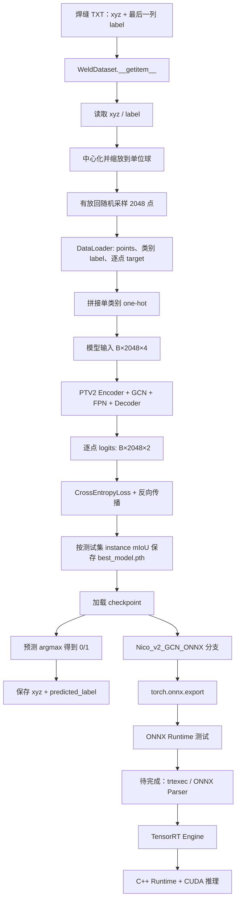

# PointTransformerV2 工业焊缝点云分割项目快速上手

## 1. 项目简介

本项目是一个基于 PointTransformerV2 的工业焊缝/焊板点云语义分割项目。输入为 TXT 格式点云，训练数据至少包含 xyz 坐标和逐点 label；模型输出每个点的二分类 logits，再通过 `argmax` 得到类别预测，用于提取焊缝候选区域。

预期部署链路：

```text
PyTorch → ONNX → TensorRT Engine → C++ CUDA 推理 → 工业检测软件集成
```

当前仓库可以看出已经尝试 PyTorch→ONNX，但本副本尚不能认定 ONNX 链路已完成，也不能直接转换为 TensorRT。主要原因：

- 当前工作区没有完整训练数据集结构、主模型权重、ONNX 文件或 TensorRT Engine。
- 训练、预测和导出路径均硬编码到原作者 D 盘。
- 默认训练配置与所选模型的输入维度不一致。
- ONNX 模型内部包含 CPU/NumPy/scikit-learn 计算，无法形成正确的动态 ONNX 图。
- ONNX 导出参数、输出命名和 ONNX Runtime 测试存在明显缺口。
- 当前 `.venv` 指向另一台机器的 Conda 环境，无法直接使用。

> 仓库 `README.md` 仍描述 ModelNet/ShapeNet，与工业焊缝代码不一致。本文件所有结论以实际代码为准。

---

## 2. 项目目录结构

```text
E:\GRP-PTv2
├─ config/                         # Hydra 配置
│  ├─ partseg_v2_improved.yaml     # 当前较新的训练配置
│  ├─ partseg_v2_improved_predict.yaml
│  ├─ ONNXpartseg_v2_improved_predict.yaml
│  └─ model/                       # 各模型分支配置
├─ data/
│  ├─ test_input/                  # 独立预测输入样例，2048×4
│  ├─ test_output/                 # 预测结果
│  ├─ V1/、V2/                     # 不同版本预测结果
│  └─ Best_GCN_LFA_FPN/            # 模型结果文件
├─ models/
│  ├─ Nico/                        # 基础 PTV2
│  ├─ Nico_v2_GCN/                 # GCN 版本
│  ├─ Nico_v2_GCN_LFA/             # LFA/GCN/FPN 实验版本
│  ├─ Nico_v2_GCN_Drop/            # 当前训练配置默认选择
│  ├─ Nico_v2_preGCN_Drop/         # 前置 LFA 版本
│  ├─ Nico_v2_GCN_ONNX/            # ONNX 适配分支
│  └─ testParameters/
│     ├─ GCN_res/best_model.pth
│     └─ GCN_LFA_res/best_model.pth
├─ train_partseg_weld_V2improved.py # 当前焊缝训练主入口
├─ predict_partseg_weld.py           # 基于 Dataset 的预测入口
├─ predict_partseg_weld2.py          # 直接读 TXT 的实验入口
├─ export2ONNX.py                    # ONNX 导出
├─ testOnnx.py                       # ONNX Runtime 测试
├─ dataset.py                        # Dataset 定义
├─ pointnet_util.py                  # 点云归一化等工具
├─ provider.py                       # 数据增强
├─ requirements.txt
└─ README.md                         # 上游 ModelNet/ShapeNet 说明
```

仓库没有独立的 `train/`、`test/` 或 `inference/` 目录，相关入口都放在根目录。

### 2.1 数据集目录

实际训练读取类是 `dataset.py:265` 的 `WeldDataset`。它需要：

```text
data/weld/
├─ synsetoffset2category.txt
├─ train_test_split/
│  ├─ shuffled_train_file_list.json
│  ├─ shuffled_val_file_list.json
│  └─ shuffled_test_file_list.json
└─ <类别对应目录>/*.txt
```

关键代码：

- 类别文件读取：`dataset.py:269-279`
- 数据集划分：`dataset.py:285-291`
- 文件枚举：`dataset.py:292-318`
- TXT 加载和字段提取：`dataset.py:334-357`

当前 `data/` 下没有这些类别文件和划分 JSON，因此 `data/V1`、`data/V2`、`data/test_input` 不能直接作为 `WeldDataset` 根目录。现有 `data/test_input/*.txt` 每个文件是 2048 行、4 列；前三列为 xyz，第四列被当前脚本当作 ground-truth label。

### 2.2 Model 目录

| 模型目录 | 用途/状态 |
|---|---|
| `models/Nico` | 基础 PointTransformerV2 |
| `models/Nico_v2_GCN` | GCN 版本 |
| `models/Nico_v2_GCN_L` | GCN 位置实验 |
| `models/Nico_v2_GCN_LFA` | GCN/LFA/FPN 实验 |
| `models/Nico_v2_GCN_Drop` | 当前训练配置默认选择，但输入维度冲突 |
| `models/Nico_v2_preGCN_Drop` | 前置 LFA 版本 |
| `models/Nico_v2_GCN_L_Res` | GCN/残差实验 |
| `models/Nico_v2_GCN_ONNX` | ONNX 适配分支 |
| `models/testParameters` | 参数实验代码及两个现有 checkpoint |

每个 Nico PTV2 分支通常包含：

```text
model.py       # 整体语义分割网络
ptv2_utils.py  # PTV2 Block、GVA、上下采样、插值和网格聚类
```

### 2.3 配置文件

- 训练：`config/partseg_v2_improved.yaml`
- Dataset 预测：`config/partseg_v2_improved_predict.yaml`
- ONNX 导出：`config/ONNXpartseg_v2_improved_predict.yaml`
- 模型映射：`config/model/*.yaml`

训练配置关键值（`config/partseg_v2_improved.yaml:1-10`）：

```yaml
batch_size: 4
epoch: 200
learning_rate: 1e-3
gpu: 0
num_point: 2048
optimizer: Adam
weight_decay: 1e-4
normal: False
lr_decay: 0.5
step_size: 20
```

### 2.4 Checkpoint 保存位置

训练代码在 `train_partseg_weld_V2improved.py:282-295` 保存相对路径 `best_model.pth`。Hydra 配置在 `config/partseg_v2_improved.yaml:22-28` 声明运行目录：

```text
log/partseg/${model.name}
```

配置没有显式设置 `hydra.job.chdir`，所以最终绝对位置受 Hydra 版本和工作目录行为影响。正式训练前应改为明确路径。

仓库实际只发现：

- `models/testParameters/GCN_res/best_model.pth`
- `models/testParameters/GCN_LFA_res/best_model.pth`

它们均未被当前预测或 ONNX 导出入口直接引用。

---

## 3. 完整运行流程



### 3.1 数据读取与预处理

`WeldDataset.__getitem__()`（`dataset.py:334-357`）：

1. `np.loadtxt()` 加载 TXT。
2. `normal_channel=False` 时取 `data[:,0:3]`。
3. 取 `data[:,-1]` 并转为 `int32` 逐点标签。
4. xyz 做单位球归一化。
5. 用 `np.random.choice(..., replace=True)` 有放回采样 `npoints` 个点。
6. 返回 `(point_set, cls, seg)`。

归一化函数位于 `pointnet_util.py:15-20`：

```python
centroid = np.mean(pc, axis=0)
pc = pc - centroid
m = np.max(np.sqrt(np.sum(pc**2, axis=1)))
pc = pc / m
```

即使原始文件恰有 2048 点，有放回采样仍会产生重复点和遗漏点。工业部署必须建立确定性采样及预测到原始点的索引回映射。

### 3.2 训练流程

入口：`train_partseg_weld_V2improved.py:88` 的 `main(args)`。

1. Hydra 读取训练配置。
2. 设置 `CUDA_VISIBLE_DEVICES`。
3. 用硬编码 D 盘路径创建 `WeldDataset(trainval/test)`。
4. 创建 DataLoader。
5. 动态导入 `models.<name>.model.PTV2Segmentation`。
6. 对 xyz 随机缩放和平移。
7. 用 scikit-learn `kneighbors_graph` 在 CPU 生成稠密邻接矩阵 `[B,N,N]`。
8. xyz 拼接一维类别 one-hot，形成 `[B,N,4]`。
9. 模型返回 `(points_xyz, logits)`，训练取第二项。
10. logits 展平为 `[B×N,2]`，使用 `CrossEntropyLoss`。
11. 反向传播和参数更新。
12. 验证 accuracy/IoU。
13. instance mIoU 不低于历史最佳值时保存 checkpoint。

关键位置：

- Dataset/DataLoader：`train_partseg_weld_V2improved.py:96-103`
- 模型构建：`train_partseg_weld_V2improved.py:105-117`
- checkpoint 加载：`train_partseg_weld_V2improved.py:119-127`
- 数据增强：`train_partseg_weld_V2improved.py:174-183`
- 邻接矩阵和前向：`train_partseg_weld_V2improved.py:185-196`
- Loss/优化：`train_partseg_weld_V2improved.py:197-207`
- 验证：`train_partseg_weld_V2improved.py:212-278`
- checkpoint 保存：`train_partseg_weld_V2improved.py:282-295`

### 3.3 推理流程

入口：`predict_partseg_weld.py:65`。

1. 读取 `WeldDataset(test)`。
2. 从硬编码路径加载 checkpoint。
3. 每个 Dataset 样本重新随机采样。
4. 拼接类别 one-hot 得到 `[1,2048,4]`。
5. CPU/scikit-learn 计算邻接矩阵。
6. 模型输出 `[1,2048,2]` logits。
7. `argmax` 得到 0/1 标签。
8. 保存归一化后的 xyz 和预测标签。

关键位置：`predict_partseg_weld.py:105-132`。

当前预测通过 `target[0,0]` 确定类别（`predict_partseg_weld.py:123`），意味着输入仍需真值 label，不是真正的无标签工业推理。当前只有一个 `weld` 类别组，正式推理应移除 target 依赖。

### 3.4 ONNX 导出流程

入口：`export2ONNX.py:73`。

1. 读取 `config/ONNXpartseg_v2_improved_predict.yaml`。
2. 导入 `models/Nico_v2_GCN_ONNX/model.py`。
3. 从硬编码路径加载 checkpoint。
4. 构造 `[1,2048,4]` CUDA dummy input。
5. `torch.onnx.export()`，opset 16。
6. 输出相对路径 `model.onnx`。

导出调用：`export2ONNX.py:127-132`。

---

## 4. 关键入口文件

| 用途 | 入口 | 状态 |
|---|---|---|
| 当前焊缝训练 | `train_partseg_weld_V2improved.py` | 主入口，但默认配置不可直接运行 |
| 早期 V2 训练 | `train_partseg_weld_V2.py` | 旧版 |
| Dataset 预测 | `predict_partseg_weld.py` | 依赖带真值标签的数据集 |
| 直接 TXT 预测 | `predict_partseg_weld2.py` | 源码注明暂不可用 |
| ONNX 导出 | `export2ONNX.py` | 已调用 export，但存在关键错误 |
| ONNX Runtime | `testOnnx.py` | 随机输入运行，不是数值一致性验证 |
| Dataset | `dataset.py` | `WeldDataset` |
| ONNX 模型 | `models/Nico_v2_GCN_ONNX/model.py` | 将邻接计算移入 `forward()` |
| PTV2 算子 | `models/Nico_v2_GCN_ONNX/ptv2_utils.py` | PTB、GVA、上下采样、插值、聚类 |

---

## 5. 模型输入输出

### 5.1 Dataset/DataLoader 输出

| 数据 | Shape | 类型/含义 |
|---|---:|---|
| `points` | `[B,2048,3]` | `float32`，归一化 xyz |
| `label` | `[B,1]` | `int64`，点云类别；当前只有 weld 一类 |
| `target` | `[B,2048]` | `int64`，逐点语义标签 |

拼接 one-hot 后：

```text
model_input = [x, y, z, category_one_hot]
shape       = [B, 2048, 4]
dtype       = float32
```

对应代码：`train_partseg_weld_V2improved.py:190-194`。

### 5.2 模型输出

`PTV2Segmentation.forward()` 返回：

```text
points_xyz: [B,N,3]
logits:     [B,N,2]
```

输出是 logits，没有 Softmax。训练时将 `[B,N,2]` 展平为 `[B×N,2]` 后使用 `CrossEntropyLoss`；预测时在最后一维执行 `argmax`。

仓库只定义：

```python
seg_classes = {'weld': [0, 1]}
```

代码没有说明 0/1 分别代表背景还是焊缝，必须从原始标注规范确认，不能凭经验假设。

---

## 6. PointTransformerV2 网络结构

当前 PTV2/GCN/FPN 分割网络大致为：

```text
输入 [B,N,4]
  → Linear 4→48
  → PTV2 Block(48)
  → GCN(48)
  → TransitionDown 48→96, grid=0.06
  → PTV2 Block(96, K=16)
  → TransitionDown 96→192, grid=0.13
  → PTV2 Block(192, K=2)
  → TransitionDown 192→384, grid=0.325
  → PTV2 Block(384, K=1)
  → TransitionDown 384→512, grid=0.8125
  → PTV2 Block(512, K=1)
  → 4级 TransitionUp + skip connection + FPN
  → Linear 48→2
  → 逐点 logits [B,N,2]
```

模型定义：`models/Nico_v2_GCN_Drop/model.py:142-276`。

### 6.1 PointTransformerV2Block

位于 `models/Nico_v2_GCN_Drop/ptv2_utils.py:200`：

1. `torch.cdist` 计算全点对距离。
2. `torch.topk(..., largest=False)` 找 KNN。
3. `index_points` 提取邻居坐标和特征。
4. `GroupVectorAttention` 计算局部注意力。
5. Linear 映射并加入 residual。

### 6.2 Group Vector Attention

位于 `ptv2_utils.py:163`，包含 Q/K/V Linear、基于坐标差的位置编码、分组 Conv2d 权重编码、Softmax、分组聚合、BatchNorm、ReLU 和 Linear。

### 6.3 TransitionDown / TransitionUp

`TransitionDownBlock` 位于 `ptv2_utils.py:94`：

- Linear 升维；
- BatchNorm + ReLU；
- 网格聚类；
- 网格内特征 max pooling；
- 网格内坐标求均值。

网格聚类后的点数依赖实际输入分布，是动态 ONNX/TensorRT 部署的主要难点。

`TransitionUpBlock` 位于 `ptv2_utils.py:110`：

- 对低分辨率特征做 Linear；
- `torch.cdist + topk` 逆距离插值；
- 融合 encoder skip feature。

### 6.4 GCN/LFA 实际状态

GCN 确实参与前向：

```python
out = torch.matmul(adj, x)
out = self.linear(out)
```

`Nico_v2_GCN_Drop` 定义了 LFA，但前向调用被注释。

`models/testParameters/GCN_LFA_res/model.py:200-209` 虽执行 `points_features = self.LFA(points_features)`，但主干继续使用 LFA 前已经计算的 `out`，所以 LFA 结果没有进入最终预测路径。当前代码不能证明 LFA 实际改善了有效前向。

---

## 7. 当前运行阻塞点

### 7.1 默认训练配置输入维度冲突

`config/partseg_v2_improved.yaml:16` 默认选择 `Nico_v2_GCN_Drop`，但其构造函数在 `models/Nico_v2_GCN_Drop/model.py:142-146` 定义：

```python
def __init__(self, cfg, in_dim=19):
```

训练实际输入是 `[B,N,4]`，会在 `Linear(19,48)` 处维度错误。除非切换到 4 维输入模型或恢复 19 维特征构造，否则默认训练入口不能直接运行。

### 7.2 数据和权重路径硬编码

- `train_partseg_weld_V2improved.py:97`
- `predict_partseg_weld.py:67-75`
- `export2ONNX.py:75-84`

均引用原作者 `D:/xlxlqqq/...` 路径，当前机器无法使用。

### 7.3 预测模型与 checkpoint 分支不一致

预测配置最终映射到 `Nico_v2_GCN`，但硬编码权重名是 `V2_GCN_LFA_Res_Best`。不同分支 state dict 很可能不兼容。加载失败还会被裸 `except` 吞掉，随后使用随机初始化模型继续预测，产生“程序成功但结果无效”的风险。

### 7.4 checkpoint 恢复不完整

checkpoint 保存 optimizer state，但恢复训练只加载模型和 epoch；也从保存的 epoch 而非下一轮继续，影响严格复现。

### 7.5 不支持无标签工业推理

当前预测依赖 ground-truth target。工业输入通常只有 xyz 或 xyz+传感器特征，应移除该依赖。

### 7.6 无法回映射原始点

Dataset 不返回采样索引。后续至少需要返回：

```text
sampled_points
sample_indices
normalization_parameters
```

才能把预测映射回原始完整点云。

---

## 8. ONNX 部署状态

### 8.1 已实现内容

- 调用了 `torch.onnx.export()`，opset 16。
- 建立 `Nico_v2_GCN_ONNX` 分支。
- 用纯 PyTorch `GridCluster` 替换 `torch_cluster.grid_cluster`。
- 修改 `index_points`，尝试规避 `expand/gather` 差异。
- 将 `bincount` 改成 `zeros + scatter_add_`。
- 存在 ONNX Runtime 测试脚本。

### 8.2 不能认定 ONNX 已完成的原因

#### 无 ONNX 产物

当前工作区没有任何 `.onnx`，也没有 `log/partseg/Nico_v2_GCN_ONNX/`，无法验证已有模型。

#### 邻接矩阵计算不能正确导出

ONNX 模型 `forward()` 内执行：

```text
CUDA Tensor → CPU → NumPy → sklearn kneighbors_graph → Torch Tensor
```

位置：`models/Nico_v2_GCN_ONNX/model.py:13-26`、`model.py:222-224`。

NumPy/scikit-learn 不会成为 ONNX 节点。传统 tracing 会把按 dummy input 得到的邻接矩阵固化为常量，不能随真实输入变化。这是当前最严重的问题。

#### opset 16 与 scatter_reduce amax 冲突

`models/Nico_v2_GCN_ONNX/ptv2_utils.py:107-109` 使用 `scatter_reduce_(reduce="amax")`。ONNX `ScatterElements` 到 opset 18 才加入 max/min reduction，而当前导出 opset 为 16。参考：[ONNX ScatterElements](https://onnx.ai/onnx/operators/onnx__ScatterElements.html)。

#### 两个输出只命名一个

模型返回 `(points_xyz, logits)`，导出却只设置：

```python
output_names=["output"]
```

多输出应分别命名。参考：[PyTorch ONNX 导出文档](https://docs.pytorch.org/docs/main/onnx_export.html)。若旧导出器容忍，第一个命名输出对应 `points_xyz`，而现有 ORT 测试只读 `outputs[0]`，可能测试的不是分割 logits。

#### 动态轴声明错误

当前 `dynamic_axes`：

- 声明了不存在的 `"indices"`；
- batch 轴未设动态；
- feature 轴被设动态，但 Linear 要求固定为 4；
- logits 输出未声明动态点数；
- 数据相关聚类输出不是简单动态轴能解决的。

首版 TensorRT 建议固定 `B=1,N=2048,C=4`，先打通静态图。

#### 权重缺失仍继续导出

checkpoint 加载异常被裸 `except` 吞掉，因此可能导出随机权重模型。正式导出必须加载失败立即终止，并记录 checkpoint SHA256、模型分支和配置。

#### ORT 测试不是数值一致性验证

`testOnnx.py:91-112` 只创建 Session、构造随机输入、运行并打印 `outputs[0].shape`。缺少：

- `onnx.checker.check_model`
- PyTorch/ORT 相同输入
- logits 输出确认
- 最大绝对/相对误差
- argmax 一致率
- 真实点云验证
- 多 batch/点数验证

### 8.3 自定义算子状态

`export2ONNX.py` 注册 `torch_cluster::grid` 的 symbolic，输出 `CustomNamespace::GridCluster`。但活动 ONNX 分支使用纯 PyTorch `GridCluster()`，原 `torch_cluster` 调用已注释，因此 custom symbolic 当前不一定进入图。

如果恢复原始 `torch_cluster` 算子，ONNX Runtime 和 TensorRT 都需要自定义实现；仓库没有对应 ORT Custom Op 或 TensorRT Plugin。

### 8.4 能否直接转换 TensorRT

结论：当前不能。

主要阻碍：

- CPU/scikit-learn KNN
- 数据相关的 Unique、网格聚类和聚类点数
- `scatter_reduce amax`
- Python batch 循环
- 动态聚类输出
- 稠密 `[N,N]` 邻接矩阵
- 两输出和错误动态轴
- 缺少可信 ONNX 和 PyTorch/ORT parity

TensorRT 动态输入需要构建 min/opt/max optimization profile，并在运行时设置 input shape。参考：[TensorRT Dynamic Shapes](https://docs.nvidia.com/deeplearning/tensorrt/latest/inference-library/dynamic-shapes-basics.html)。

如果 ONNX Parser 不支持关键节点，需要重写图或实现 TensorRT Plugin。参考：[TensorRT 错误说明](https://docs.nvidia.com/deeplearning/tensorrt/latest/reference/troubleshooting-error-messages.html)。

---

## 9. 环境要求

`requirements.txt` 当前只有：

```text
numpy
torch
tqdm
hydra-core==1.2
omegaconf
```

实际还依赖：

```text
scikit-learn
torch-geometric
torch-cluster
torchinfo
torchsummary
onnx
onnxruntime 或 onnxruntime-gpu
```

TensorRT 部署还需要：

```text
NVIDIA Driver
CUDA Toolkit/Runtime
TensorRT
trtexec
CMake
C++ 编译器
CUDA headers/libraries
```

`.venv/pyvenv.cfg` 指向不存在的 `C:\Users\Someone\.conda\envs\pointtransformer`，不能复用。

仓库没有锁定 Python、PyTorch/CUDA、torch-geometric/torch-cluster、ONNX/ORT、TensorRT 和 Driver 版本。下一阶段应先依据目标 GPU 和操作系统确定版本矩阵，再创建干净环境。

---

## 10. 下一步 TensorRT 部署计划

### 阶段 A：冻结唯一模型版本

- 确定唯一 `model.py + config + checkpoint`。
- `load_state_dict(strict=True)` 必须成功。
- 禁止加载失败后继续。
- 记录 checkpoint 路径和 SHA256。
- 固定真实点云重复推理结果一致。
- 确认 0/1 标签语义。
- 明确最终采用的 GCN/LFA/FPN 模块。

### 阶段 B：定义工业输入输出协议

首版建议固定：

```text
input:  float32 [1,2048,3] 或 [1,2048,4]
output: float32 [1,2048,2]
label:  int32   [1,2048]
```

必须明确 xyz 单位/坐标系、归一化、点数处理、采样索引、原始点回映射，以及输出概率/label/焊缝点坐标的需求。

### 阶段 C：建立 PyTorch Golden Baseline

保存固定真实输入和结果：

```text
raw_points.txt
normalized_points.npy
sample_indices.npy
pytorch_logits.npy
pytorch_labels.npy
```

同时记录推理时间、显存、焊缝点数和有真值时的 accuracy/IoU。

### 阶段 D：重构 ONNX 可导出图

快速验证方案：把邻接矩阵移出模型，作为第二输入：

```text
points: [B,N,4]
adj:    [B,N,N]
```

这最容易验证 ONNX/TensorRT 主干，但 C++ 侧仍需 KNN，且稠密邻接矩阵开销大。

长期生产方案：

- CUDA KNN/ball query
- CUDA voxel/grid pooling
- CUDA interpolation
- 必要时封装 TensorRT Plugin V3

首版固定 `B=1,N=2048,C=4`，模型只返回 logits，不返回未使用的 xyz。

### 阶段 E：严格 ONNX 验证

```text
PyTorch FP32
→ torch.onnx.export
→ onnx.checker.check_model
→ ONNX shape inference
→ ONNX Runtime CPU
→ ONNX Runtime CUDA
→ PyTorch/ORT logits 数值对比
→ 多个真实样本回归
```

建议记录 `max_abs_error`、`max_rel_error` 和 argmax agreement；不能只验证“能运行”和 shape。

### 阶段 F：TensorRT Engine

先用 `trtexec`：

```text
trtexec --onnx=model.onnx --saveEngine=model_fp32.engine
trtexec --onnx=model.onnx --fp16 --saveEngine=model_fp16.engine
```

动态 shape 时设置 `--minShapes`、`--optShapes`、`--maxShapes`。参考：[TensorRT 性能测试](https://docs.nvidia.com/deeplearning/tensorrt/latest/performance/benchmarking.html)。

验收顺序：

```text
TensorRT FP32 vs PyTorch FP32
→ TensorRT FP16 vs FP32
→ 性能/显存
→ 再决定是否 INT8
```

### 阶段 G：C++ CUDA Runtime

```text
TXT/传感器数据
→ 确定性预处理
→ pinned host memory
→ cudaMemcpyAsync
→ 设置 profile/input shape
→ 设置 tensor address
→ enqueueV3
→ logits/argmax
→ 原始点索引回映射
→ 焊缝候选区域
```

C++ 工程建议包含：

```text
engine_builder/   # ONNX→Engine
runtime/          # Engine 反序列化和推理
preprocess/       # 归一化、采样、KNN
postprocess/      # argmax、回映射、焊缝提取
plugins/          # KNN/voxel/interpolate 插件（如需要）
tests/            # PyTorch/ORT/TRT 一致性数据
```

---

## 11. 一天内理解项目的建议顺序

1. 阅读 `dataset.py:265-360`，理解 TXT、归一化和采样。
2. 阅读 `train_partseg_weld_V2improved.py:88-207`，理解输入和 loss。
3. 阅读 `models/Nico_v2_GCN_Drop/model.py` 的 `PTV2Segmentation`。
4. 阅读 `ptv2_utils.py` 的 PTV2 Block、TransitionDown、TransitionUp。
5. 阅读 `predict_partseg_weld.py:65-132`，理解当前推理限制。
6. 对比 `models/Nico_v2_GCN_ONNX` 与普通分支。
7. 阅读 `export2ONNX.py:73-132` 和 `testOnnx.py:90-118`。
8. 在部署修改前确认唯一可信 checkpoint 和模型分支。

---

## 12. 当前最优先结论

当前优先级不是直接编写 TensorRT C++，而是先通过三个基础门槛：

1. **正确 checkpoint**：模型结构和权重严格匹配。
2. **可复现 PyTorch 推理**：去掉随机采样、真值依赖和裸异常吞噬。
3. **数值可信 ONNX**：移除 CPU/NumPy/scikit-learn 前向计算，完成 PyTorch/ORT logits 对比。

只有这三个门槛通过后，ONNX→TensorRT Engine 和 C++ CUDA Runtime 才有稳定基础。
